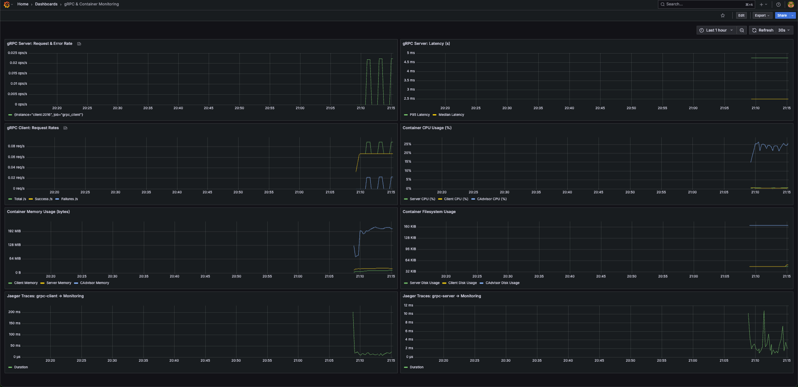

# gRPC Monitoring Demo with Prometheus & Grafana

This project demonstrates how to instrument a Go gRPC service with Prometheus for metrics, cAdvisor for container-level stats, and Jaeger for distributed tracing—unified in Grafana.

### Why This Project?

* During my recent DevOps work with Prometheus, Loki, Grafana, OpenTelemetry and related tools, I fell in love with real-time observability. I wanted to build something hands-on, so ...
* This demo shows an end‑to‑end setup: from instrumenting code to visualizing metrics in Grafana.
* As a Go & gRPC enthusiast, I wanted a clean, reproducible example that anyone can clone and run.

## Project Overview

* **gRPC server**: A Go server exposing a `Monitoring` RPC. Instrumented with Prometheus middleware for request counts, error rates, and latencies, with OpenTelemetry traces to Jaeger.
* **gRPC client**: A Go client that periodically sends correct (`ping`) and incorrect (`wrong`) requests to the server. Exposes its own Prometheus metrics (total, success, and failure counts), with OpenTelemetry traces to Jaeger.
* **cAdvisor**: Collects CPU, memory, disk, and network metrics for all containers.
* **Jaeger All-in-One** → collects OTLP spans. Accessible at `http://localhost:16686` and dashboard in grafana.
* **Prometheus**: Scrapes metrics from the gRPC server (`:2001/metrics`), gRPC client (`:2016/metrics`), cAdvisor (`:8080/metrics`), and itself. Runs at `:9099`.
* **Grafana**: Auto‑imports a dashboard that shows both application and container metrics. Accessible at `http://localhost:3005`.

## Repository Structure

```
.
├── certs/                         # mTLS files and instructions (README inside)
├── client/
│   ├── cmd/ 
│   │   ├──main.go
│   │   └──open_telemetry.go
│   └── internal/
│       ├── config/                # Client config loader
│       ├── pb/                    # Generated protobuf for monitoring.proto
│       ├── security/              # Client TLS credentials loader
│       └── service/               # Client code (sends ping/wrong periodically)
├── server/
│   ├── cmd/ 
│   │   ├──main.go
│   │   └──open_telemetry.go
│   └── internal/
│       ├── config/                # Server config loader
│       ├── pb/                    # Generated protobuf for monitoring.proto
│       ├── security/              # Server TLS credentials loader
│       └── service/               # Service implementation (Monitoring RPC)
├── monitoring/
│   ├── grafana/
│   │   └── provisioning/          # Grafana provisioning folder
│   │       ├── dashboards/
│   │       │   ├── dashboards.yaml
│   │       │   └── grpc_monitoring_dashboard.json
│   │       └── datasources/
│   │           ├── prometheus-datasource.yml
│   │           └── jaeger-datasource.yml
│   └── prometheus/
│       └── prometheus.yml         # Prometheus scrape configuration
├── image/
│   └── grafana.png                # Example Grafana dashboard screenshot
├── docker-compose.yml             # Orchestrates server, client, cAdvisor, Prometheus, Grafana
└── README.md                      # (this file)
```

## Prerequisites

* **Docker & Docker Compose** installed on your machine.
* **Go 1.24+** (if you want to rebuild the client/server locally).

## Generate mTLS Certificates

All TLS materials live under`./certs`. To generate them, follow the instructions in that folder:

```
cd certs
# Read certs/README.md and run the commands to generate CA, server, and client certificates.
```

After following those steps, `certs/` should contain:

```
ca.crt.pem
ca.key.pem
client.crt.pem
client.key.pem
server.crt.pem
server.key.pem
server_ext.cnf
client_ext.cnf
```

## Running the Stack

1. **Build and start all services**

   From the repo root:

   ```bash
   docker-compose up -d --build
   ```

   This will launch:

    * `grpc_server` (listening on `:50059` for gRPC, `:2001/metrics` for Prometheus)
    * `grpc_client` (sends ping/wrong, exposes `:2016/metrics`)
    * `cadvisor` (exposes `:8080/metrics` for container stats)
    * `prometheus` (on `:9099`; scrapes server, client, cAdvisor, and itself)
    * `jaeger` (on `:16686`; receives spans from both server & client (via OTLP))
    * `grafana` (on `:3005`; auto‑imports the dashboard)

2. **Verify Prometheus targets**

   Open `http://localhost:9099` in your browser. Under **Status → Targets**, you should see four jobs in the “UP” state:

    * `grpc_server:2001`
    * `grpc_client:2016`
    * `cadvisor:8080`
    * `prometheus:9090`

3. **Verify Jaeger all in one**

   Open Jaeger’s UI at `http://localhost:16686`
   In the “Search” form at the top:
      * Select Service = grpc-server (or grpc-client if you prefer).
      * Leave “Operation” blank (it will show all gRPC operations).
      * Click Find Traces.
   Click any trace ID in the list to view the span timeline.
      * You’ll see spans for `Monitoring.MonitoringService/Monitoring` (on the server side) and corresponding client spans from grpc-client. 
   As soon as traces start flowing, you’ll be able to drill into each span’s details—timestamps, tags, and any custom metadata you’ve injected.
   
4. **View Grafana dashboard**

   Open `http://localhost:3005`. Log in with the default `admin` / `admin` credentials. 
   Navigate to **Dashboards → Manage** and select **“gRPC & Container Monitoring”**. You will see panels for:

    * gRPC server request & error rates, P95/median latency.
    * gRPC client total/success/failed request rates.
    * Container CPU %, memory usage, and filesystem usage for `grpc_server` and `grpc_client`.
    * Spans from Jaeger for `grpc_server` and `grpc_client`.

   

---

## Final words

Modern observability stacks are incredibly powerful and ever-evolving. I’m excited to continue learning about Prometheus, Grafana, Jaeger, OpenTelemetry and other tools to build even more robust systems.

This project is meant to help not just me, but also you—so you can follow along, experiment, and build your own monitoring pipelines!

## Further Reading

* [Prometheus](https://prometheus.io/docs/)
* [Grafana](https://grafana.com/docs/)
* [Jaeger](https://www.jaegertracing.io/docs/1.18/)
* [OpenTelemetry](https://opentelemetry.io/docs/)
* [cAdvisor](https://github.com/google/cadvisor)

Feel free to explore these official resources to deepen your understanding of modern monitoring and observability tools.

Happy monitoring!😎